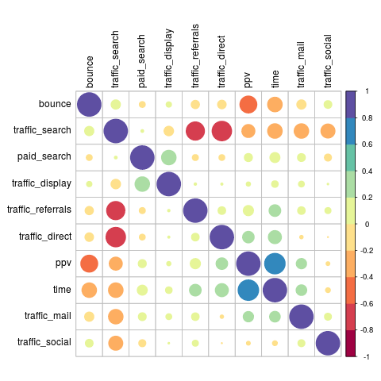
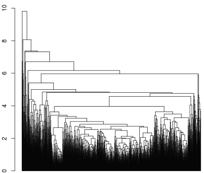

```{r, echo=FALSE, include=FALSE}
setwd("../")
source("src/main.R")
```

\newpage

# Introducción

El comercio electrónico viene creciendo sostenidamente desde hace varios años impulsado por factores como son el aumento del alcance de Internet, la disminución de costos de computadoras y la adopción de tecnología por parte de los usuarios finales, entre otros. 

Muchos de los sitios de comercio electrónico que operan en la actualidad ejecutan diferentes estrategias de marketing digital para hacer crecer el volumen del negocio. Además de ello, desde el punto de vista del usuario final, algunos sitios generan mayor tracción que otros, que a largo plazo se transforman en visitas repetidas y un mayor tiempo de permanencia por cada visita.

En el presente trabajo se analizarán un conjunto de sitios de comercio electrónico para intentar descubrir características que presentan aquellas empresas que están mejor posicionadas a nivel mundial e identificar patrones basados en el comportamiento de los usuarios y acciones de marketing digital.

# Conjunto de datos

Alexa Internet es una empresa perteneciente a Amazon.com que ofrece varios servicios para poder realizar investigación de mercado. Es un referente desde el punto de vista de las estimaciones de tráfico a sitios webs, que las realiza obteniendo datos a partir de instalaciones de diferentes toolbars que se agregan en navegadores web. Además de ello, SimilarWeb, es otra compañía muy reconocida en la industria que ofrece soluciones basadas en datos para entender el comportamiento del mercado en Internet.

Los datos del presente análisis se basan en el ranking de Alexa.com junto con información obtenida desde SimilarWeb.com. Algunos ejemplos de datos:

* https://www.similarweb.com/website/google.com.ar
* http://www.alexa.com/siteinfo/google.com.ar

## Variables del análisis


| Variable          |                   Descripción                   |
|-------------------|:-----------------------------------------------:|
| url               | Dirección del sitio web                         |
| position          | Pertenece al Top 50.000 mundial                 |
| bounce            | Porcentaje de visitas con una sola página vista |
| ppv               | Páginas vistas por visita                       |
| time              | Tiempo promedio de la visita                    |
| paid_search       | Tráfico pago                                    |
| traffic_direct    | Tráfico directo                                 |
| traffic_display   | Tráfico de redes de publicidad                  |
| traffic_search    | Tráfico de buscadores                           |
| traffic_mail      | Tráfico de correo electrónico                   |
| traffic_social    | Tráfico de redes sociales                       |
| traffic_referrals | Tráfico referido desde otras páginas            |

Las variables fueron obtenidas directamente desde la fuente de datos. La variable *position* está construída utilizando el ranking a nivel mundial de Alexa. Algunas estadísticas de resumen:

```{r,echo=FALSE}
as.data.frame(t(do.call(cbind, lapply(df.num.nos, summary))))
```


# Análisis

El desarrollo del análisis se va a centrar en describir los sitios en función de la variable *position*, que indica si un sitio pertenece a aquellos con mayor nivel de tráfico.

## Diferencias entre grupos según el tiempo de la visita

El vector de medias de las variables según la posición global de los sitios nos brinda información sobre cada uno de los grupos. Resulta de interés comprender si existen diferencias significativas entre ellos.

```{r,echo=FALSE}
as.data.frame(tables.means)
```

El Tiempo de Visita (time) es un indicador muy importante para medir el nivel de actividad de los usuarios en cada sitio de comercio electrónico. Se espera intuitivamente que los sitios con mayor tráfico en la web tengan un Tiempo de Visita elevado.

Debemos analizar la normalidad de los datos para comprender el tipo de prueba a realizar, es decir si será un test paramétrico o no paramétrico.

```{r fig.align="center", echo=FALSE}
plots.time
```

```{r fig.height = 3, fig.width = 4, fig.align="center", echo=FALSE}
qqnorm(df$time,cex.main=0.8,cex.lab=0.8,cex.axis=0.8)
qqline(df$time, col = 2)
```

Gráficamente se visualiza que los datos no son normales. Además de ello, podemos verificarlo mediante un test de Shapiro-Wilk.

```{r, echo=FALSE}
tables.shapiro
```

Nuestra hipótesis nula es que los datos siguen una distribución normal. El test rechaza dicha hipótesis, por lo cual los datos no presentan normalidad.

A continuación vamos a verificar la normalidad de los grupos por separado.

```{r fig.align="center", echo=FALSE}
plots.timehist
```

Gráficamente vemos que la población de la variable position con valor 0 presenta una asimetría muy marcada con cola pesada hacia la derecha. Al aplicar el test de Shapiro-Wilk sobre los grupos obtenemos lo siguiente:

```{r, echo=FALSE}
tables.time
```

El p-valor obtenido rechaza la hipótesis nula de normalidad.

### Transformación Box-Cox

Podemos intentar realizar transformaciones Box-Cox sobre la variable de estudio para corregir la falta de normalidad. Luego de buscar varios parámetros lambda, se obtiene la siguiente mejora:

```{r fig.align="center", echo=FALSE}
plots.boxcox
boxcox
```

Se obtienen algunas mejoras pero se continúa rechazando la hipótesis nula de normalidad, por lo que procederemos a realizar un test no paramétrico para verificar diferencias entre las distribuciones.

### Prueba de Mann-Whitney-Wilcoxon

Para proseguir y verificar si hay diferencias significativas entre los grupos respecto a la variable Tiempo de Visita, se realiza la prueba de rangos no paramétrica de Mann-Whitney-Wilcoxon.

Esto nos lleva a plantear las siguientes hipótesis:

- $H_0$: No hay diferencias significativas. Los grupos pertenecen a la misma distribución.
- $H_1$: Existen diferencias significativas entre los grupos.

```{r,  echo=FALSE}
tables.wilcox
```

Se rechaza la hipótesis nula, por lo que dicha variable brinda información sobre diferencias entre sitios con poco y mucho tráfico.

## Componentes principales

El conjunto de datos en análisis posee una cantidad considerable de variables. Si quisiéramos visualizarlas todas al mismo tiempo sería prácticamente imposible o muy difícil de interpretar. Con componentes principales podemos hacer una reducción de la dimensionalidad y obtener mucha información sobre las variables y su correlación.

Componentes principales necesita que las variables en estudio estén correlacionadas. Para entender esto vamos a visualizar la siguiente matriz de correlaciones.

```{r fig.align="center",out.width = "300px",out.height = "300px",echo=FALSE}

```


Observando el gráfico se pueden visualizar variables que tienen un nivel de correlación importante entre sí, sin embargo, esto no es extremadamente marcado.


```{r fig.align="center", fig.width=4,fig.height=3, echo=FALSE}
plots.scree
```

El gráfico nos da la pauta de que si bien las primeras componentes capturan una buena porción de la variabilidad, las variables no están altamente correlacionadas, por lo que para obtener un porcentaje alto de explicación de los datos nos vemos obligados a seleccionar al menos 4 variables siguiendo el criterio de Kaiser. Para que el análisis se pueda interpretar mejor, continuaremos con 3 componentes, con los cuales explicamos aproximadamente el 60% de la variabilidad de los datos.

```{r fig.align="center", echo=FALSE}
plots.pc1
```

Los loadings de la componente #1 nos permite interpretar el engagement de los sitios. Es decir, son sitios donde los usuarios tienen alto nivel de actividad.

```{r fig.align="center", echo=FALSE}
plots.pc2
```

Los loadings de la componente #2 la podemos resumir como Awareness, es decir, demuestra el nivel de conocimiento que se tiene sobre la marca.

```{r fig.align="center", echo=FALSE}
plots.pc3
```

En cuanto la componente #3 está relacionada con el impacto que tienen las fuentes de tráfico pago en los sitios.

```{r fig.align="center", echo=FALSE}
plots.biplot
```

Al graficar las dos primeras componentes en un biplot y asignándole a cada sitio un color de acuerdo a si pertenecen al top 50.000, comenzamos a ver algunos patrones. Los sitios que tienen mayor tráfico se concentran a la derecha. De acuerdo a lo que veíamos en los loadings, sobre la primer componente se está representando el engagement. Por otro lado, sobre el biplot podemos resaltar algunas cuestiones:

* Correlación positiva entre el tráfico directo y el tráfico referido.
* Correlación negativa entre la tasa de rebote y las páginas vistas.

```{r fig.height = 4, fig.width = 5,fig.align="center", echo=FALSE}
plots.3d
```


## Clustering

### Jerárquico

El coeficiente de correlación cofenético brinda información sobre la capacidad que tiene un agrupamiento jerárquico de responder a la matriz de distancias de las variables analizadas.

Luego de algunas pruebas de diferentes métodos, se observa que el método *average* brinda el mejor resultado, obteniendo una correlación cofenética de 0.77, que es bastante aceptable.

```{r fig.align="center",out.width = "400px",out.height = "300px",echo=FALSE}

```


El gráfico sugiere que la cantidad de grupos existentes es elevada, parecerían existir diferentes ploblaciones. Para lograr que los resultados se puedan interpretar con claridad, vamos a definir 4 grupos que se buscarán mediante k-means. Los grupos se grafican sobre las componentes que habían sido identificadas previamente.

### K-means


```{r fig.align="center", echo=FALSE }
plots.biplot2
```

No parecerían existir grupos claramente identificados. Sin embargo, si se realiza una matriz de contingencias del cluster con la variable *position*, se visualiza que algunos grupos poseen una proporción mayor de sitios con tráfico elevado.

```{r, echo=FALSE}
tables.cluster
```

En base al agrupamiento obtenido por k-means se visualiza que en el cluster 4 hay una cantidad considerable de sitios con bajo tráfico, y por otro lado, en el grupo 3, es donde se concentran la mayor cantidad de sitios con elevado tráfico. Podríamos suponer que dentro del grupo 3 se encuentran los sitios con mejor desempeño en cuanto al nivel de interacción y calidad de las fuentes de tráfico, en donde dicho comportamiento es independiente a la cantidad de visitas que reciben. Esto es una nueva hipótesis para explorar.

## Análisis discriminante

Continuando con el análisis de nuestra variable respuesta *position* que indica si un sitio está en las posiciones más altas respecto a tráfico web, vamos a realizar un análisis discriminante, que nos permitirá encontrar una función que separe ambos grupos. Procederemos a aplicar el análisis discriminante cuadrático ante la falta de normalidad de las variables en análisis.

Para realizar el modelo, se separó el conjunto de datos en entrenamiento y test, haciendo un split de 70/30. Los resultados obtenidos que se muestran a continuación corresponden al conjunto de test.

### Matriz de confusión

```{r, echo=FALSE}
tables.matrix
```

Si bien tenemos algo de capacidad para clasificar observaciones, los resultados podrían ser mejores. Al visualizar los scores obtenidos por la función discriminante en un boxplot se puede comprender mejor que el modelo está logrando identificar los grupos en cierta medida.

```{r fig.align="center",fig.height = 3, fig.width = 4, echo=FALSE}
plots.qda
```


# Software

Para la preparación de los datos de desarrollaron algunos scripts en Python trabajando con notebooks interactivos en Jupyter. En cuanto al análisis de los datos se utilizó R mediante la aplicación RStudio, tanto para gestionar el proyecto, como para redactar la presente documentación. El código siempre se mantuvo actualizado en un repositorio del servicio GitHub.

# Conclusiones

Luego del análisis de las variables, se puede concluir que existen diferencias significativas entre sitios con poco y elevado tráfico, tanto desde el punto de vista del comportamiento de parte de los usuarios, como así también en cuanto a medios de generación de tráfico. Los sitios con elevado tráfico poseen un mayor promedio de Tiempo de Visita. Además de ello, se ha podido observar con componentes principales, que los sitios con elevado tráfico poseen valores altos en la primer componente, que representa el nivel de interacción.

Sin embargo las variables con las que se trabajó no logran tener un alto nivel explicativo de la variable respuesta *position*. Hay que tener en cuenta que los datos son obtenidos en base a estimaciones e inferencias, y una posible interpretación de esto es que se esté introduciendo ruido que suavicen las diferencias.

# Bibliografía

* Biblio 1
* Biblio 2
* Biblio 3
