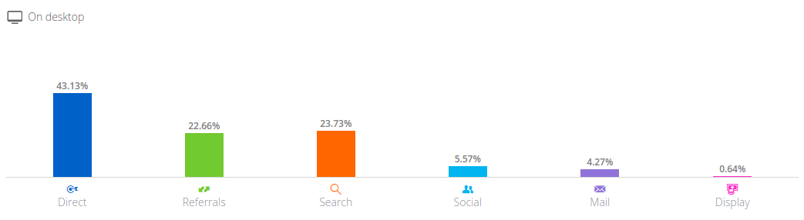
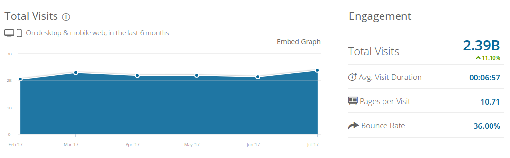

```{r, echo=FALSE, include=FALSE}
setwd("../")
source("src/main.R")
```

## Introducción

* Descubrir patrones en sitios de comercio electrónico con más visitas.
* Datos de Alexa + SimilarWeb. Ejemplo de amazon.com:

```{r fig.align="center",out.width = "250px",out.height = "250px",echo=FALSE}


```


## Variables

* Comportamiento de usuarios y fuentes de tráfico web.

| Variable          |                   Descripción                   |
|-------------------|:-----------------------------------------------:|
| url               | Dirección del sitio web (ID)                    |
| position          | Pertenece o no al Top 50.000 mundial (Clase)    |
| bounce            | Porcentaje de visitas con una sola página vista |
| ppv               | Páginas vistas por visita                       |
| time              | Tiempo promedio de la visita                    |
| paid_search       | Tráfico pago                                    |
| traffic_direct    | Tráfico directo                                 |
| traffic_display   | Tráfico de redes de publicidad                  |
| traffic_search    | Tráfico de buscadores                           |
| traffic_mail      | Tráfico de correo electrónico                   |
| traffic_social    | Tráfico de redes sociales                       |
| traffic_referrals | Tráfico referido desde otras páginas            |

## Vector de medias

* Diferencia en la media de los grupos
* ¿ Son significativas ?

```{r,echo=FALSE}
as.data.frame(tables.means)
```


## Tiempo de visita - Distribución

```{r fig.align="center", echo=FALSE}
plots.timehist
```

## Tiempo de visita - Normalidad

* Prueba de Shapiro-Wilk
```{r fig.align="center", echo=FALSE}
tables.time
```

* Transformación de Box-Cox
```{r fig.align="center", echo=FALSE}
boxcox
```

## Tiempo de visita - Prueba de Mann-Whitney-Wilcoxon

- $H_0$: Los grupos pertenecen a la misma distribución.
- $H_1$: Existen diferencias significativas en la distribución.

```{r,  echo=FALSE}
tables.wilcox
```

## Matriz de correlación

* Correlación negativa entre Search vs Referido y Directo.
* Correlación positiva entre Directo y Tiempo de Visita.

```{r fig.align="center",out.width = "200px",out.height = "200px",echo=FALSE}
knitr::include_graphics("../fig/corr.png")
```


## Componentes principales - Scree Plot

* Tres componentes explican el 60% de la variabilidad.

```{r, echo=FALSE}
plots.scree
```


## Componentes principales - Componente 1

* Nivel de interacción
* Componente de forma

```{r, echo=FALSE}
plots.pc1
```

## Componentes principales - Componente 2

* Conocimiento de marca
* Componente de forma

```{r, echo=FALSE}
plots.pc2
```

## Componentes principales - Componente 3

* Tráfico pago
* Componente de forma

```{r, echo=FALSE}
plots.pc3
```

## Componentes principales - Biplot

* Grupo 1 proyecta valores positivos sobre la primer componente.
* Grupo 1 tiene mayor Tiempo de Visita, tráfico Directo, Referido y desde Email.
* Grupo 0 tiene mayor Bounce.

```{r fig.align="center", echo=FALSE, warning=FALSE}
plots.biplot
```

<!-- ## Clustering - Jerárquico -->

<!-- ```{r fig.align="center",out.width = "200px",out.height = "200px",echo=FALSE} -->
<!-- knitr::include_graphics("../fig/dend_edit.png") -->
<!-- ``` -->


## Clustering - K-means

```{r fig.align="center", echo=FALSE, warning=FALSE }
plots.biplot2
```

<!-- ## Clustering - Grupos según posición global -->

<!-- * Cluster 3 concentra a los primeros sitios del ranking. -->
<!-- * Cluster 4 concentra a los últimos sitios del ranking. -->

<!-- ```{r, echo=FALSE} -->
<!-- tables.cluster -->
<!-- ``` -->

## Clustering - Grupos identificados

* Cluster 3: Baja tasa de rebote, elevado tiempo de visita, elevado tráfico directo.
* Cluster 4: Bajo nivel de páginas por visita, elevado tráfico pago.
* ¿ Hub vs Authority ?

```{r, echo=FALSE}
as.data.frame(t(aggregate(df.num.nos,list(df$cluster),function(x) c(mean = round(mean(x, na.rm=TRUE), 2)))))
```

## Análisis discriminante - Resumen

* No se satisfacen supuestos de normalidad y homocedasticidad
* Análisis discriminante cuadrático
* 70% training / 30% testing.

```{r, echo=FALSE,size="scriptsize"}
tables.matrix
```

## Análisis discriminante - Puntuaciones

```{r fig.align="center",fig.height = 3, fig.width = 4, echo=FALSE}
plots.qda
```


## Software

* Python: Preparación de datos.
* RStudio: Análisis y documentación.
* GitHub: Almacenamiento y versionado del código.

## Conclusiones

* Los resultados permiten hacer un diagnóstico de los sitios de comercio electrónico.
* El Tiempo de Visita es significativamente más elevado en sitios con mayor volumen de tráfico.
* Sus principales fuentes de tráfico son Directo, Email y Referido.
* Los sitios con poco nivel de tráfico presentan mayor Tasa de Rebote.
* Para trabajos futuros, se podrían aplicar otros métodos que intenten mejorar el desempeño de clasificación del análisis discriminante.